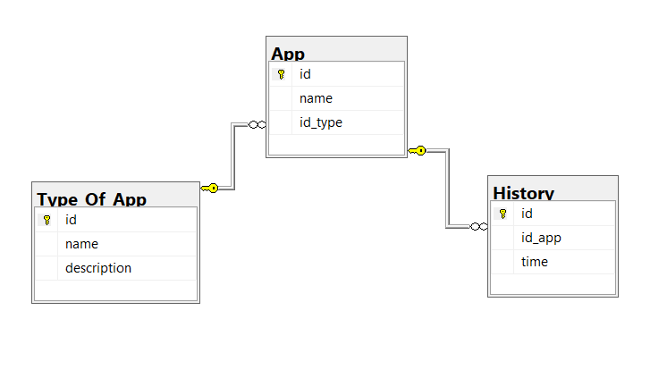
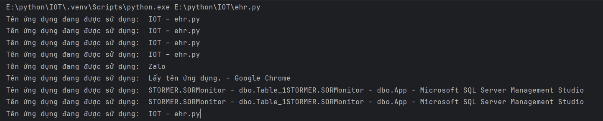
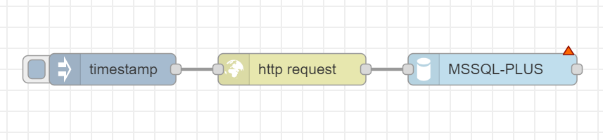
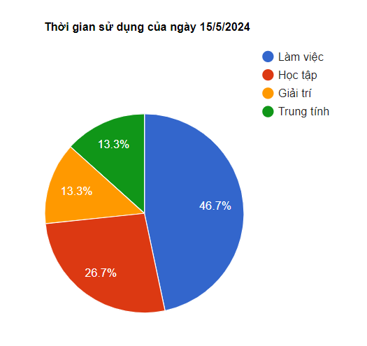
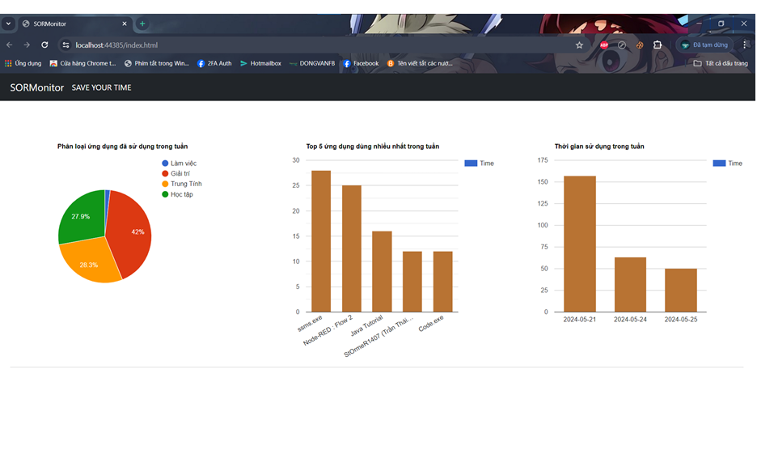

# SORMonitor - SAVE YOUR TIME.
## Giới thiệu tác giả 

👨‍🔬Họ tên: Trần Thái Học.

🆔MSSV: K205510205187.

🧑‍🏫Lớp: K56KMT.01.

📖Tên môn học: Lập trình python.

## Giới thiệu về Project
Hệ thống giám sát thời gian sử dụng ứng dụng được sử dụng để lưu lại thời gian làm việc trên máy tính/laptop, từ đó có thể giúp người dùng có thể xem lại quá trình làm việc của một ngày và phân chia thời gian cho hợp lí.

## Tổng quan về Project
### 1. Cơ sở dữ liệu
Hệ thống sử dụng cơ sở dữ liệu MSSQL Server, bao gồm có 3 bảng như sau:

Trong đó: App sử dụng dể lưu lại thông tin về ứng dụng

Type_Of_App sử dụng để phân loại ứng dụng (làm việc, học tập, giải trí...)

History lưu lịch sử làm việc của laptop

### 2.Module đọc dữ liệu

Chương trình sẽ sử dụng thư viện 'pygetwindow' để lấy tên cửa sổ đang active. Nó sẽ kiểm tra rằng hiện tại có cửa sổ ứng dụng nào đang chạy, nếu có thì sẽ trả về tên của cửa sổ (ứng dụng) đó, còn không thì trả về None

### 3.NodeRed

Nodered sẽ liên tục gọi tới api của fastapi sau mỗi một giây, nhận được kết quả thực thi Procedure trong MSSQL.

### 4.Web
Web sẽ vẽ biểu đồ tổng quan về các ứng dụng đã sử dụng sau một ngày làm việc, bao gồm:

Biểu đồ tròn dùng để có cái nhìn tổng quan về loại ứng dụng đã sử dụng trong tuần 

Biểu đồ cột giữa dùng để hiển thị chi tiết về top 5 ứng dụng đã sử dụng trong tuần

Biểu đồ cột bên phải dùng để hiển thị thời gian đã sử dụng laptop trong một tuần